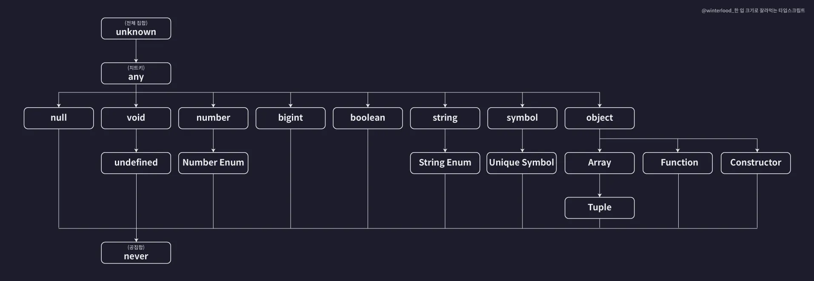

### 🧨 any 타입

특정 변수의 타입을 우리가 확실히 모를때 사용합니다. (치트키)

```
let value: any;

value = 1;
value = "hello";
value = true;
value = [1, 2, 3];

```

- 타입 검사를 완전히 비활성화합니다.
- 다른 어떤 타입에도 자유롭게 할당 가능하고, 연산도 가능합니다.
- 하지만 런타임 오류 가능성이 크기 때문에 최후의 수단으로만 사용해야 합니다.

### 🔒 unknown 타입

모든 값을 담을 수 있지만, 사용은 제한적

```
let value: unknown;

value = 1;
value = "hello";
// value + 1; ❌ 연산 불가능

if (typeof value === "number") {
  console.log(value + 1); // ✅ 조건부 타입 검사 후 사용 가능
}

```

- any와 비슷하게 모든 값을 할당할 수 있지만,

- 실제 사용할 땐 타입을 좁히는 과정이 필요함

- 타입 안정성이 높아 any보다 훨씬 안전
- ✅ 권장되는 타입:
  모르는 값을 처리할 때는 any보다 unknown을 사용하세요.

### 🕳️ void 타입

"void -> 공허 -> 아무것도 없다."

"아무것도 반환하지 않음"을 의미하는 타입"

- 주로 return을 하지 않는 함수에 사용

- undefined를 할당할 수 있고,

- null도 가능하지만 strictNullChecks가 꺼져 있어야 함

### 🛑 never 타입

존재하지 않는 불가능한 타입, 절대 발생할 수 없는 값

```
function error(): never {
  throw new Error("에러 발생!");
}

function infinite(): never {
  while (true) {}
}

```

undefined, null도 할당할 수 없음

any도 never에 할당할 수 없음

어떤 타입에도 할당 가능하지만, 반대로는 불가능

### 🧠 타입스크립트를 이해한다는 것?

타입스크립트를 단순히 "타입을 붙이는 언어"라고 생각하면 한계가 있습니다.
정말로 이해하려면 아래 세 가지 기준을 중심으로 봐야 합니다.

1. 어떤 기준으로 타입을 정의하는가?

2. 어떤 기준으로 타입 간의 관계를 정의하는가?

3. 어떤 기준으로 타입 오류를 검출하는가?

### 타입 호환성

- 한 타입을 다른 타입으로 취급해도 괜찮은가?

- number 리터럴 타입은 number타입에 호환된다
- number type은 number 리터럴 타입에 호환되지 않는다.
  예를 들면, number타입이 직사각형, number 리터럴 타입이 정사각형 이라고 생각하자!

```
let num1: number = 10;
let num2: 10 = 10;

num1 = num2; // ✅ 업캐스팅 (서브 → 슈퍼)
num2 = num1; // ❌ 다운캐스팅 (슈퍼 → 서브)

```

sub타입을 super타입에 취급하는 것을 업캐스팅이라고 합니다.
반대로, super타입에 sub타입에 가면 다운캐스팅이라고 합니다.

타입계층도를 보면 이해가 잘 되는 것 같습니다!

📌 업캐스팅은 안전하지만, 다운캐스팅은 런타임 위험을 수반



업 캐스팅으로 unknown에 할당을 할 순 있지만 다운캐스팅으로 subType에 할당을 할 수 없습니다!

### never 타입(공집합)

never타입은 모든 타입에 서브타입이기때문에 어느 타입에든 할당이 가능.

```
function neverFunc() : never {
    while(true) {}
}

let num: number = neverFunc() ok
let str: string = neverFunc() ok
let bool: boolean = neverFunc() ok

반대로 다운 캐스팅으로도 안된다. 어떠한 값도 저장할 수 없다.
```

### 🧨 다시 보는 any

any는 타입 계층도 자체를 무시하는 특이한 존재입니다.
모든 타입에 super에 위치하기도 하고 모든 타입에 sub이기도 하다

하지만, any가 never타입에 다운 캐스팅을 할 수 없습니다!!!

| 타입      | 특징                                    | 안전성                        |
| --------- | --------------------------------------- | ----------------------------- |
| `any`     | 아무 값이나 할당 가능, 타입 검사 없음   | ❌ 매우 낮음                  |
| `unknown` | 아무 값이나 할당 가능, 사용은 제한됨    | ✅ 높음                       |
| `void`    | 반환값 없음                             | ✅ 적절한 용도에 사용 시 안전 |
| `never`   | 어떤 값도 할당 불가, 도달 불가능한 코드 | ✅ 타입 안전 보장             |
